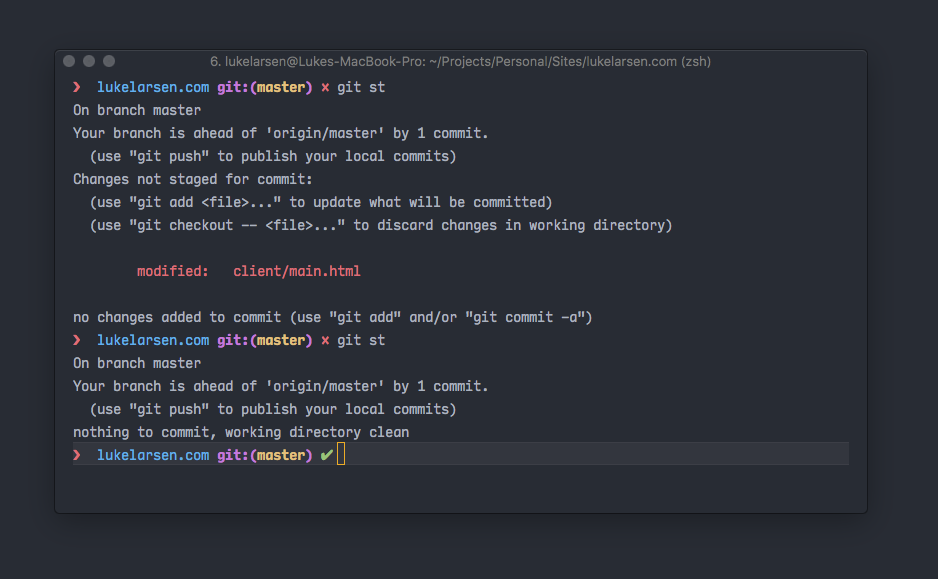
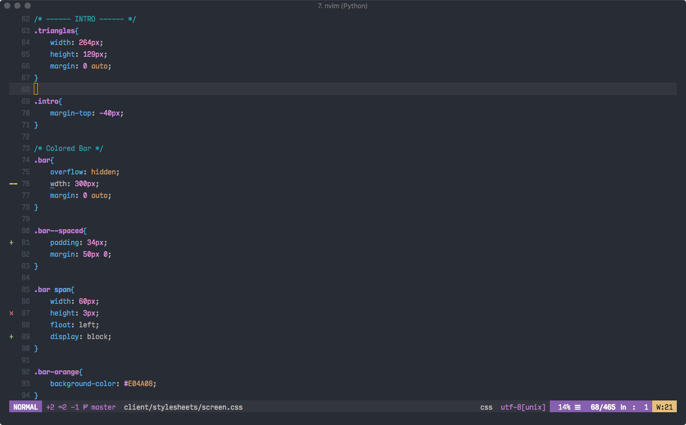
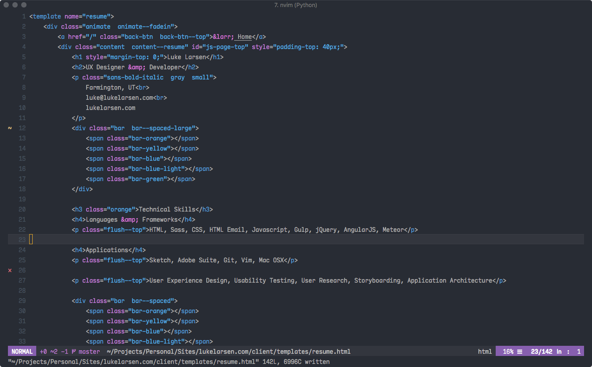
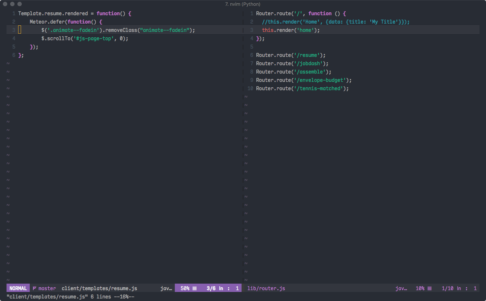

# NeoSpace
A Neovim, iTerm2 configuration inspired by Spacemacs.

## Credits
Based on:
* init.vim from [neovim-config](https://github.com/jasonprogrammer/neovim-config) by Jason Jones
* Theme from [space-vim-dark](https://github.com/liuchengxu/space-vim-dark) by Liu-Cheng Xu
* Icon from [Hyper](https://github.com/zeit/hyper) by ZEIT

## The Parts of NeoSpace
Not all of these are required. Just use what you like. If you put all of them together that is how I work.

* init.vim (Neovim config file)
* NeoSpace theme and Airline theme (not included in this repo. See [neospace-theme](https://github.com/lukelarsen/neospace-theme)
* iTerm2 settings file
* Sample .zshrc (needed to get a dark titlebar in iTerm2) & zsh-theme
* .icns icon file to replace the iTerm2 icon
* Font for use in iTerm and Neovim

## Installation
You do not need to go through each section. Just follow the directions for what you want. One Neovim plugin, [Deoplete](https://github.com/Shougo/deoplete.nvim), uses Python 3. Make sure you have it [installed](https://www.python.org/downloads/).

### Neovim and init.vim
#### 1. Install Neovim
I recommend using brew if you are on macOS.
```
brew install neovim
```

If not see the [downloads page](https://github.com/neovim/neovim/wiki/Installing-Neovim).

#### 2. Install vim-plug

Run this to install:

```
curl -fLo ~/.local/share/nvim/site/autoload/plug.vim --create-dirs \
    https://raw.githubusercontent.com/junegunn/vim-plug/master/plug.vim
```

or see the [vim-plug page](https://github.com/junegunn/vim-plug) for more information.

#### 3. Place the init.vim file & install plugins
Navigate to `~/.config/nvim/` and place the `init.vim` file in this repo in there.

Then run Neovim.
```
nvim
```

Install all the plugins.
```vim
:PlugInstall
```

Restart Neovim and you are good to go.

### Neovim and Airline theme

The NeoSpace theme and Airline theme should just work if the steps were followed for installing Neovim and init.vim above. The Neospace theme is loaded and added in the init.vim config.

If you'd like to use the NeoSpace theme without using my init.vim config visit the [NeoSpace Github page](https://github.com/lukelarsen/neospace-theme).

### iTerm2 settings file
If you would like my exact copy of all the iTerm2 settings take the `com.googlecode.iterm2.plist` file and place it somewhere on your hard drive. Then go to `iTerm2 > Preferences > General > Preferences` and check the box 'Load prefernces from a custom folder or URL' and browse to the .plist file.

If you just want the color theme see the neospace.itermcolors theme [here](https://github.com/lukelarsen/neospace-theme).

### Sample .zshrc & zsh-theme

#### .zshrc
This contains some code you might find useful. You'll probably need to copy the contents in to your own file.
It will call the neospace zsh-theme and make the titlebar of iTerm2 dark.

#### neospace.zsh-theme
This will add some coloring to iterm when in a git repo.
Place this file in your `~/.oh-my-zsh/themes` directory and make sure it is called from your `.zshrc` file

### Custom .icsn desktop icon
To use this icon go to `Applications/iterm.app` and highlight the app. Then press `cmd/i`. Then drag this icon file to the top left icon in the window. You'll need to restart the app and redrag the icon to your dock to see the new icon.

### Font
Install the fonts and then use them in `iTerm > Preferences > Profiles > Text > Font`

## Screenshots

##### Terminal


##### CSS


##### HTML


##### Javascript


##### Airline


##### Icon

